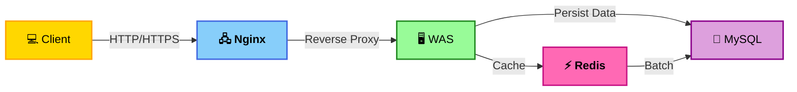

## 📌 시작 전 확인 사항

### ✔️ 실행 방법

```
$ npm install
$ npm start
```
## 기술스택
- BE<br>


-  FE<br>


## 아키텍쳐


## 성능개선
- Redis를 사용하여 db 접근을 최소화 했습니다.
<br>(100회의 게시글 조회시 db접근횟수 100회 → 1회)
  - https://mini-96.tistory.com/719
- 3800 밀리초의 게시글 조회를 150 밀리초로 개선하였습니다.
  - https://mini-96.tistory.com/716

## OAuth 구현
- 외부 라이브러리 도움 없이 직접 구현했습니다.
  - https://mini-96.tistory.com/714

## 자동배포
- main 브랜치에 push하면 자동으로 배포됩니다.
  - https://mini-96.tistory.com/667

## ERD
